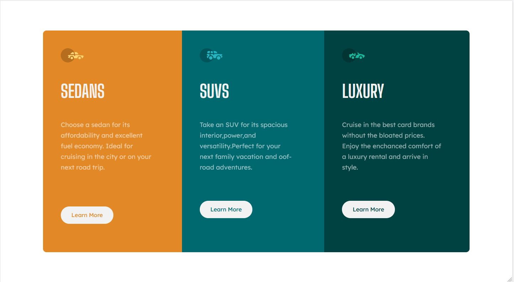
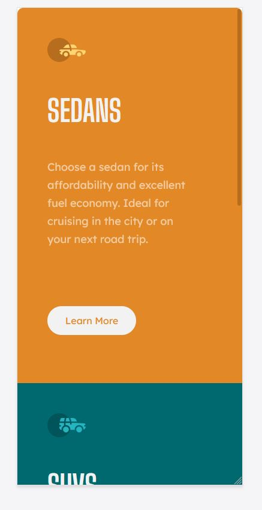

# Frontend Mentor - Stats preview card component solution

This is a solution to the [3-column preview card component challenge on Frontend Mentor](https://www.frontendmentor.io/challenges/3column-preview-card-component-pH92eAR2-). Frontend Mentor challenges help you improve your coding skills by building realistic projects. 

## Table of contents

- [Overview](#overview)
  - [The challenge](#the-challenge)
  - [Screenshot](#screenshot)
  - [Links](#links)
- [My process](#my-process)
  - [Built with](#built-with)
  - [Useful resources](#useful-resources)
- [Author](#author)

## Overview

### The challenge

Users should be able to:

- View the optimal layout depending on their device's screen size
- See hover states for interactive elements

### Screenshot

### Links

- Solution URL: [Solution URL](https://www.frontendmentor.io/solutions/htmlcss-practice-3-vZRxWpxwA)
- Live Site URL: [Live Site URL](https://stats-preview-card-challenge-9az39r5c9-spongedad2.vercel.app/)

## My process

### Built with

- Semantic HTML5 markup
- CSS custom properties
- Flexbox

### Useful resources

- [Media Queries](https://developer.mozilla.org/es/docs/Web/CSS/Media_Queries/Using_media_queries) - This helped me for make Media-queries :)
- [FlexBox](https://css-tricks.com/snippets/css/a-guide-to-flexbox/) - This helped me to use flexbox

## Author

- Frontend Mentor - [@Thranzhe](https://www.frontendmentor.io/profile/Thranzhe)
